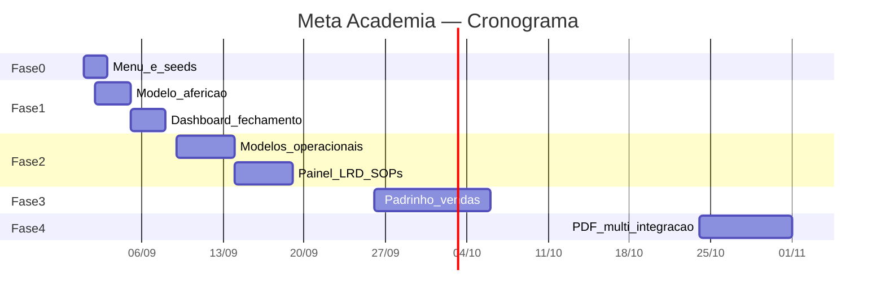

# Marcos de entrega (go-live)

## Critérios de pronto por fase

| Fase | Entregável | Critério de pronto |
|------|------------|-------------------|
| **0** | Menu + premiação | 4 itens em Meta Academia; seeds Atendente completos |
| **1** | Aferição mensal | Fechar mês calcula Conversão/Vendas/Churn; extrato premiação |
| **2** | Operação recepção | KPIs gerente visíveis; LRD registrável; cancelamentos categorizados |
| **3** | Padrinho + vendas | % régua e retenção D90 no painel |
| **4** | Integrações | PDF extrato; multi-unidade; certificação por setor |

---

## Linha do tempo — com IA (recomendado)

| Data | Marco | Horas acum. | O que a operação ganha |
|------|-------|------------:|------------------------|
| **08 set 2026** | MVP Fase 0+1 | ~36 h | Cadastro meta mensal + aferição automática + fechamento |
| **26 set 2026** | Fase 2 | ~96 h | LRD, SOPs, painel KPIs, reunião retenção |
| **24 out 2026** | Fase 3 | ~151 h | Padrinho, vendas, coordenação técnica |
| **21 nov 2026** | Fase 4 | ~200 h | PDF, multi-unidade, certificação |

---

## Linha do tempo — sem IA (referência)

| Data | Marco | Horas acum. |
|------|-------|------------:|
| **15 set 2026** | MVP Fase 0+1 | 67 h |
| **10 out 2026** | Fase 2 | 167 h |
| **31 out 2026** | Fase 3 | 257 h |
| **15 dez 2026** | Fase 4 | 337 h |

---

## Diagrama Gantt (marcos)

*Gantt acima calibrado para ritmo **com IA** (~6 h/dia).*

---

## Fluxo operacional mensal (pós Fase 1)

1. Gerente cadastra **metas do mês**
2. Recepção faz **lançamentos diários** durante o mês
3. Gerente informa **qt. ativos** e **cancelados**
4. Gerente clica **Recalcular aferição** → sistema preenche Conversão, Vendas, Churn
5. Gerente informa **NPS** e demais indicadores manuais
6. Gerente **fecha o mês** → extrato de premiação por área
